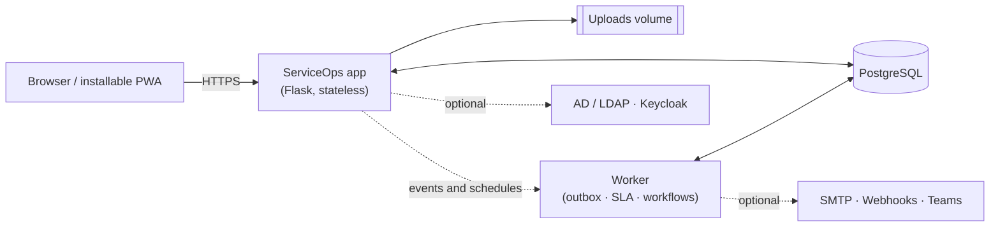

# ServiceOps

**ServiceOps is an independently built, self-hosted enterprise service-management
platform for incidents, requests, changes, problems, CMDB, service catalog,
approvals, SLAs, automation, and analytics.** It is designed for controlled
on-premises or private-cloud operation without vendor lock-in.

[](https://github.com/awijesundara/ServiceOps/actions/workflows/supply-chain.yml)
[](VERSION)
[](Dockerfile)
[](#deployment-options)
[](#architecture)

## Overview

ServiceOps provides governed IT service-management workflows with a web
application, background worker, PostgreSQL database, REST API, installable PWA,
and native iOS client. A standard single-server installation includes the
application, database, persistent uploads, automated health recovery, and daily
verified backups.

### Core capabilities

- Incident, major-incident, request, change, and problem management
- REQ, RITM, and SCTASK service-catalog fulfillment
- Configuration management database, assets, service maps, and CI ownership
- Manager, CI-owner, and CCB approval workflows with material-change reapproval
- SLA tracking, escalations, workflow automation, and durable notifications
- Knowledge, customer service, HR, security, risk, project, and field-service workspaces
- Tamper-evident audit history, signed exports, analytics, and a versioned REST API
- AD/LDAP and Keycloak integration, MFA, passkeys, and scoped authorization

## Screenshots

<table>
<tr>
<td width="50%"><br><sub>Dashboard — open work, SLA risk, and recent activity</sub></td>
<td width="50%"><br><sub>Incident — lifecycle, history, ownership, and governed actions</sub></td>
</tr>
<tr>
<td width="50%"><br><sub>Task board — drag-and-drop backed by governed transitions</sub></td>
<td width="50%"><br><sub>Service catalog — self-service ordering and fulfillment routing</sub></td>
</tr>
</table>

## Deployment options

| Environment | Recommended use | Installation method |
|---|---|---|
| RPM-managed single server | Standard production or evaluation deployment | [Fresh-server RPM installation](#fresh-server-rpm-installation) |
| Air-gapped RPM server | Restricted production network with an approved transfer host | [Offline deployment bundle](tools/offline/README.md) followed by the RPM procedure |
| Docker Compose checkout | Development or customized source deployment | [Docker Compose installation](#docker-compose-installation) |
| Kubernetes 1.27+ | High availability and horizontally scaled production | [Kubernetes installation](#kubernetes-installation) |

The RPM release supports EL8, EL9, EL10, Fedora 43, and Fedora 44. This includes
the corresponding supported RHEL, Rocky Linux, AlmaLinux, and Oracle Linux
families. For a new standalone deployment, **Rocky Linux 9 minimal** is the
recommended conservative baseline.

For an air-gapped server, obtain the RPM and Docker Engine packages from an
approved signed offline OS repository. Prepare the application and runtime-image
bundle on a connected Linux transfer host using the
[offline deployment procedure](tools/offline/README.md); it requires immutable
image digests and verifies every transferred file before loading any image.

## Fresh-server RPM installation

The following procedure installs the current stable release, **v1.78.5**, on a
fresh Rocky Linux 9, AlmaLinux 9, or Oracle Linux 9 server. Run it from a normal
administrative account with `sudo` access.

### 1. Prepare the operating system

```bash
sudo dnf upgrade --refresh -y
sudo dnf install -y dnf-plugins-core curl
sudo dnf config-manager --add-repo \
  https://download.docker.com/linux/centos/docker-ce.repo
```

If the update installed a new kernel, reboot before continuing:

```bash
sudo reboot
```

RHEL hosts should use Docker's RHEL repository instead:

```bash
sudo dnf config-manager --add-repo \
  https://download.docker.com/linux/rhel/docker-ce.repo
```

### 2. Download and verify the RPM

```bash
mkdir -p serviceops-install
cd serviceops-install

curl -fLO https://github.com/awijesundara/ServiceOps/releases/download/v1.78.5/serviceops-1.78.5-1.el9.noarch.rpm
curl -fLO https://github.com/awijesundara/ServiceOps/releases/download/v1.78.5/serviceops-1.78.5-1.el9.noarch.rpm.sha256

sha256sum -c serviceops-1.78.5-1.el9.noarch.rpm.sha256
```

Do not continue unless checksum verification reports `OK`. Packages for the
other supported platforms are available on the
[v1.78.5 release page](https://github.com/awijesundara/ServiceOps/releases/tag/v1.78.5).

### 3. Install and initialize ServiceOps

```bash
sudo dnf install -y ./serviceops-1.78.5-1.el9.noarch.rpm
sudo serviceops setup --mode bundled --yes
```

The RPM declares its required host packages, including Docker Engine, Docker
Compose, systemd, Python, curl, OpenSSL, and archive utilities. The setup command
then:

- enables Docker and deploys digest-pinned ServiceOps and PostgreSQL containers;
- generates application, administrator, and database secrets;
- creates persistent database, upload, configuration, and backup storage;
- enables the ServiceOps systemd service;
- enables two-minute health monitoring with automatic recovery; and
- enables daily verified database and upload backups.

Record the generated administrator password in an approved password manager. It
is shown once during setup.

### 4. Verify the deployment

```bash
sudo systemctl status serviceops.service
sudo systemctl status serviceops-health.timer
sudo systemctl status serviceops-backup.timer

sudo serviceops status
sudo serviceops health
sudo serviceops doctor
```

Health should report status `ok` and version `1.78.5`.

### 5. Sign in securely

The safe default listens only on `127.0.0.1:8080`. For initial administration,
open an SSH tunnel from your workstation:

```bash
ssh -L 8080:127.0.0.1:8080 your-user@your-server-address
```

Open <http://127.0.0.1:8080> and sign in with:

- **Username:** `admin`
- **Password:** the password generated during setup

Change the password immediately. For organizational rollout, configure SSO and
retain a secured local account only for break-glass recovery.

### 6. Configure production access

Keep ServiceOps bound to loopback and publish it through an organizational HTTPS
reverse proxy or managed load balancer. Configure DNS and a trusted TLS
certificate before making the service available to users.

- Expose only TCP 80 and 443 publicly.
- Never expose PostgreSQL or application port 8080 to the internet.
- Restrict SSH using the organization's access-control policy.
- Do not disable the host firewall to make the application reachable.

The RPM intentionally does not alter firewall rules, DNS, or TLS configuration;
those controls depend on the hostname and network policy selected by the
operator. Caddy and Nginx examples are available in the
[deployment guide](https://github.com/awijesundara/serviceops-notes/blob/main/docs/DEPLOYMENT.md#https-and-network-exposure).

### 7. Verify backup and recovery

```bash
sudo serviceops backup
sudo serviceops rehearse-recovery
```

The bundled installation stores persistent data in these locations:

| Path | Purpose |
|---|---|
| `/etc/serviceops/serviceops.env` | Generated configuration and secrets, mode `0600` |
| `/var/lib/serviceops/backups` | Verified PostgreSQL and upload recovery sets |
| `/opt/serviceops` | Packaged control plane, Compose files, and operational tools |

Daily local recovery sets are retained for 35 days while preserving at least
seven complete sets. Production installations should additionally copy backups
to encrypted, immutable, off-host storage. Local backups alone do not protect
against host or storage loss.

## Docker Compose installation

For a source checkout, clone the repository and use either the guided installer
or unattended server installer:

```bash
git clone https://github.com/awijesundara/ServiceOps.git
cd ServiceOps
chmod +x serviceops

./serviceops install web
# Or:
./serviceops install server --mode bundled --port 8080 --bind 127.0.0.1 --yes
```

The guided Installation Center runs at <http://127.0.0.1:8090>. It validates
Docker, ports, PostgreSQL, identity integrations, and production security policy
before deployment.

## Kubernetes installation

Kubernetes production deployment requires an immutable image digest, at least
two application replicas, external highly available PostgreSQL, and shared RWX
upload storage. The chart rejects production configuration that omits these
controls.

```bash
cp deploy/kubernetes/values-production.example.yaml \
  deploy/kubernetes/values-production.yaml
# Configure image.repository, image.digest, ingress, storage class, and replicas.
./serviceops install kubernetes --preflight
./serviceops install kubernetes
```

See the [deployment guide](https://github.com/awijesundara/serviceops-notes/blob/main/docs/DEPLOYMENT.md)
for external-database, ingress, backup, restore, rollback, and scaling guidance.

## Operations

### Common RPM commands

```bash
sudo serviceops status
sudo serviceops health
sudo serviceops doctor
sudo serviceops logs
sudo serviceops restart
sudo serviceops backup
sudo serviceops rehearse-recovery
```

### Updating safely

Do not update a production instance without a verified backup and migration
rehearsal:

```bash
sudo serviceops backup
sudo serviceops rehearse-upgrade
sudo serviceops doctor
sudo serviceops update
sudo serviceops health
```

`rehearse-upgrade` clones production data into a disposable database, runs the
candidate migration there, and verifies rollback material without modifying the
live database. Upgrade one released minor version at a time. See
[Deployment guide: Upgrades](https://github.com/awijesundara/serviceops-notes/blob/main/docs/DEPLOYMENT.md#upgrades)
for the complete rollback and schema-compatibility procedure.

## Architecture

ServiceOps uses a stateless Flask application, one worker process, PostgreSQL,
and persistent upload storage. Search, cache, and object-storage integrations are
optional adapters rather than mandatory runtime dependencies.



The application can scale horizontally behind a load balancer. The worker is a
single always-on process responsible for SLA breach detection, workflow
automation, and durable notification and webhook delivery.

## iPhone application

The native [ServiceOps iOS application](https://github.com/awijesundara/ServiceOps_iOS)
uses each user's authenticated ServiceOps session and never embeds a shared API
key. It supports incidents, changes, work notes, approvals, knowledge and CMDB
search, biometric locking, passkeys, MFA, and APNs notifications.

## Production checklist

- Put the application behind an HTTPS reverse proxy and keep its internal port private.
- Store generated secrets in an approved vault and rotate the bootstrap administrator password.
- Configure encrypted, immutable off-host backups and perform quarterly restore exercises.
- Configure AD/LDAP or Keycloak before broad rollout.
- Enable operating-system security updates, disk alerts, monitoring, and centralized logs.
- Size Gunicorn workers and threads using load tests representative of actual concurrency.
- Review login rate limits when many users share a NAT or VPN egress address.
- Verify ticket creation, CI-owner approvals, email delivery, audit exports, and backups before go-live.

## Documentation

- [Deployment and operations guide](https://github.com/awijesundara/serviceops-notes/blob/main/docs/DEPLOYMENT.md)
- [Platform manual PDF](docs/ServiceOps_Complete_Platform_Manual.pdf)
- [REST API reference](docs/API_REFERENCE.md), also served from `/api/v1/docs`
- [Development and release documentation](https://github.com/awijesundara/serviceops-notes)
- [Air-gapped deployment bundle](tools/offline/README.md)

Every pull request and push to `main` enters the supply-chain quality gate.
After a `main` run succeeds, the governed-release pipeline automatically creates
the next patch version, re-runs the release gates against that immutable tag,
publishes and verifies the signed image, SBOM, provenance, and install-tested RPM
matrix, and publishes the stable GitHub release. Major and minor releases remain
available through the manual governed-release dispatch. Failed or superseded
validation runs cannot publish a release, and release commits do not recursively
start another release.

Application code, runtime documentation, tests, and the generated platform
manual are maintained in this repository. Development notes, deployment
runbooks, engineering references, and release-readiness evidence are maintained
in the companion `serviceops-notes` repository.

## Development

```bash
python -m venv .venv
source .venv/bin/activate
pip install -r requirements-dev.txt
pytest -q
```

## Project independence

ServiceOps is independently implemented. It is not ServiceNow, is not marketed
as ServiceNow-compatible, and contains no third-party proprietary code, licensed
connectors, commercial datasets, or hosted AI services. External discovery,
SIEM, HRIS, identity, messaging, mapping, and AI capabilities require connecting
the systems selected and governed by the deploying organization.
