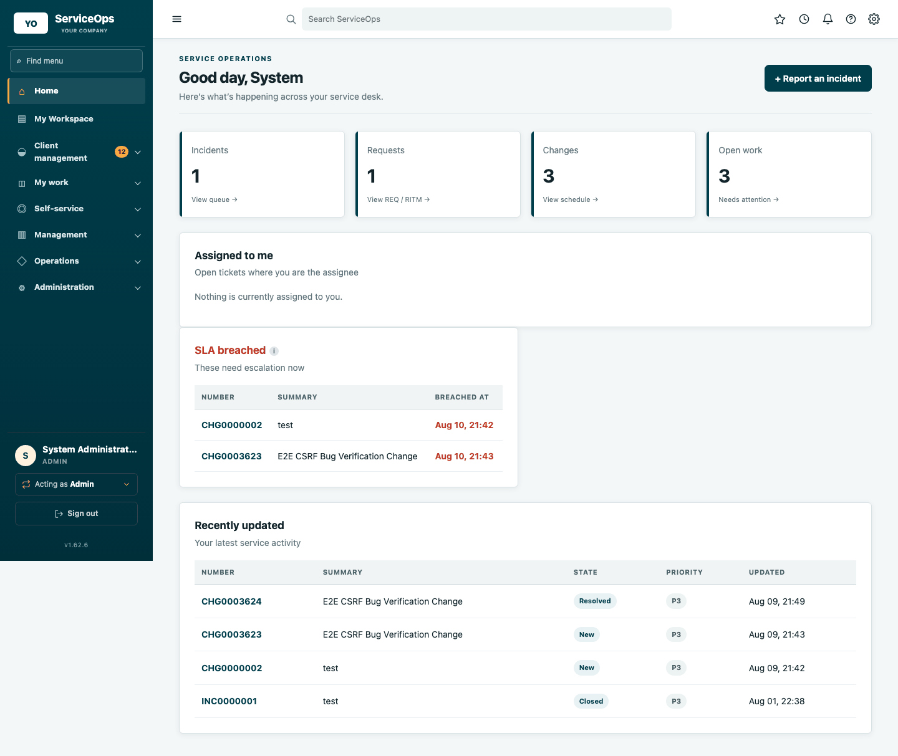
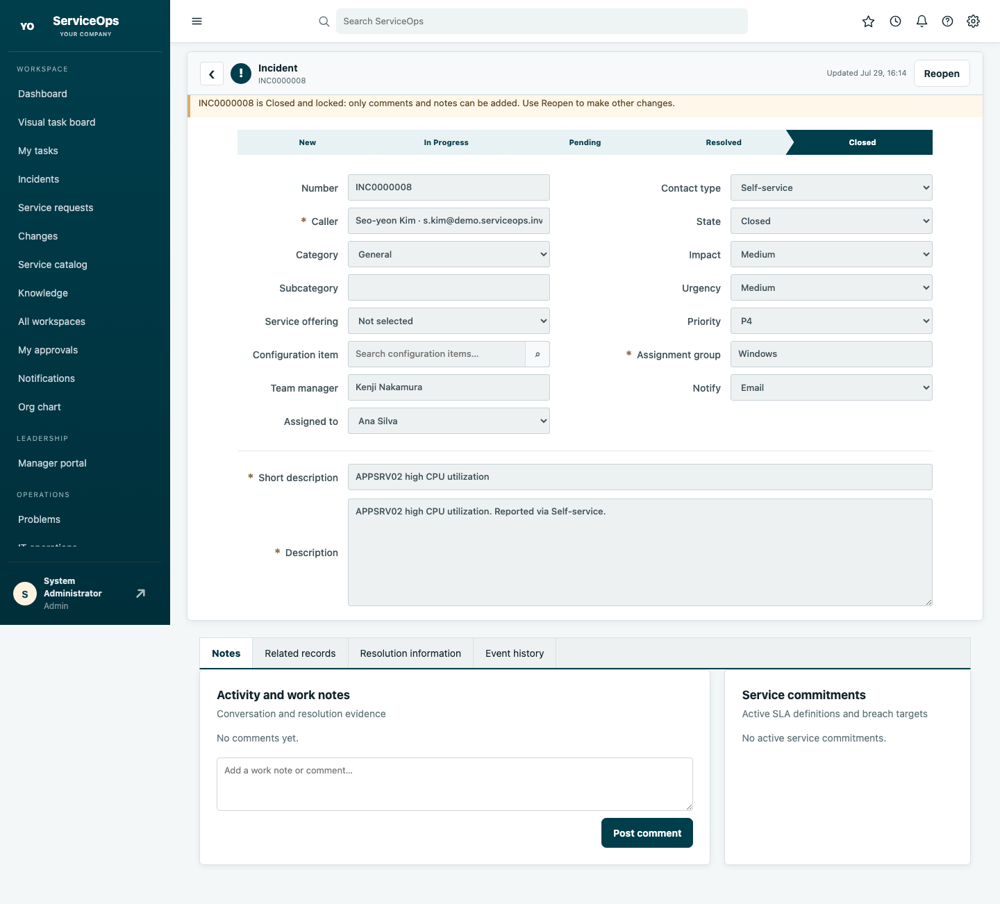
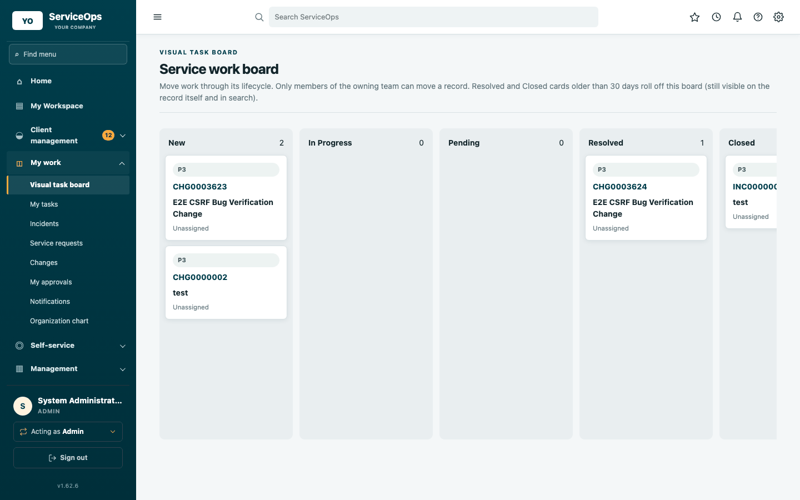
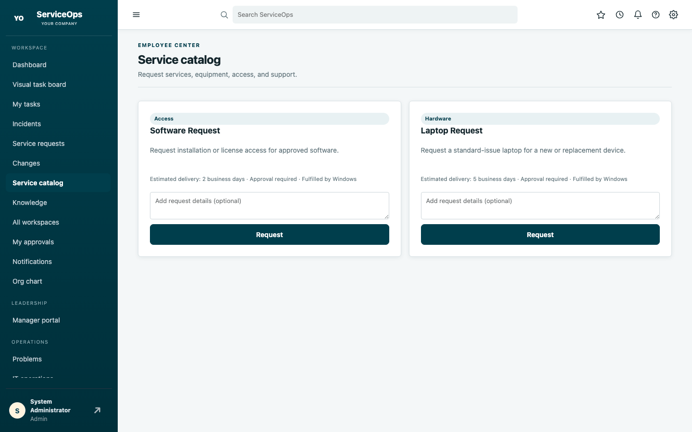
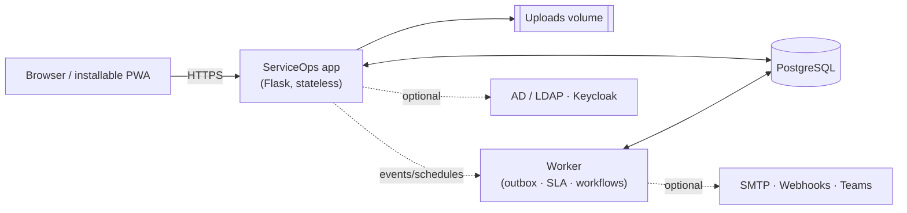

# ServiceOps

**An independently built, self-hosted enterprise service-management
platform** — incidents, requests, changes, problems, CMDB, catalog,
approvals, SLAs, and analytics, deployable with one command and no vendor
lock-in.

[](https://github.com/awijesundara/ServiceOps/actions/workflows/supply-chain.yml)
[](VERSION)
[](Dockerfile)
[](#quick-start)
[](#quick-start)

## What it looks like

<table>
<tr>
<td width="50%"><br><sub>Dashboard — open work, SLA risk, and recent activity at a glance</sub></td>
<td width="50%"><br><sub>Incident detail — lifecycle stepper, event history, owning-team controls</sub></td>
</tr>
<tr>
<td width="50%"><br><sub>Visual task board — drag-and-drop, backed by the same governed transitions as the form</sub></td>
<td width="50%"><br><sub>Service catalog — self-service ordering with approval and fulfillment routing</sub></td>
</tr>
</table>

## Architecture, briefly

A single Flask application, one worker process, one PostgreSQL database.
Nothing else is required to run it; search, cache, and object storage are
optional adapters, not dependencies.



The app is stateless and horizontally scalable behind a load balancer; the
worker is a single always-on process that drives SLA breach detection,
workflow automation, and durable delivery of notifications/webhooks.

## ServiceOps for iPhone

The native [ServiceOps iOS app](https://github.com/awijesundara/ServiceOps_iOS)
uses an authenticated ServiceOps user session—never a shared embedded API key.
It supports incidents and changes, work notes, approvals, knowledge and CMDB
search, Face ID or Touch ID locking, passkeys, MFA, and APNs ticket and security
notifications. Signed-in users can also open **ServiceOps mobile** from the web
sidebar or Help Center for connection and administrator setup guidance.

## Quick start

```bash
git clone <your-serviceops-repository> serviceops && cd serviceops
chmod +x serviceops
./serviceops install web       # opens the guided Installation Center at :8090
```

The Installation Center checks the Docker host, port availability,
PostgreSQL, AD/LDAP, Keycloak metadata, and production security policy
before it lets you deploy — and it creates only a break-glass administrator
account, never demo users or sample data.

Prefer a one-shot, non-interactive install, or already know you want
Kubernetes? See [Installing](#installing) below.

## Included workflows

<details>
<summary>Incident, change, problem, and major-incident management</summary>

Priority calculated from impact × urgency, state/assignment/approval
history, SLA timers, checklists, attachments, related-record linking, and
owning-team-scoped operational control.
</details>

<details>
<summary>Service catalog, requests, and fulfillment</summary>

REQ → RITM → SCTASK hierarchy, configurable per-item fulfillment routing,
sequential/parallel fulfillment tasks, and need-to-know request visibility.
</details>

<details>
<summary>CMDB, assets, and service mapping</summary>

Configuration items with lifecycle state, criticality, ownership, and
relationships; change-conflict detection against impacted CIs and services;
NetBox and CSV/spreadsheet import.
</details>

<details>
<summary>Approvals, governance, and audit</summary>

Manager/CCB approval chains, material-change reapproval, a tamper-evident
HMAC hash-chained audit log with signed export, and a declarative
authorization policy.
</details>

<details>
<summary>Automation, integrations, and reporting</summary>

Git-backed declarative workflows, durable SMTP/webhook/Teams delivery,
authenticated monitoring ingestion, a versioned REST API, manager and
tenant-wide analytics, CSV/PDF export.
</details>

<details>
<summary>Knowledge, HR, security, and other enterprise workspaces</summary>

Knowledge base, customer service, HR cases, security incidents,
vulnerabilities, risk/compliance findings, project/program/demand
portfolios, and field-service work orders.
</details>

## Installing

**Docker Compose (single server), guided:**

```bash
./serviceops install web        # browser installer at http://127.0.0.1:8090
```

**Docker Compose, unattended:**

```bash
./serviceops install server --mode bundled --port 8080 --bind 127.0.0.1 --yes
```

**Kubernetes 1.27+, for production:**

```bash
cp deploy/kubernetes/values-production.example.yaml deploy/kubernetes/values-production.yaml
# set image.repository / image.digest, ingress, storage class, replicas
./serviceops install kubernetes --preflight
./serviceops install kubernetes
```

Kubernetes production requires an immutable image digest, 2+ application
replicas, external HA PostgreSQL, and shared RWX upload storage — the chart
rejects a deployment missing any of those. Full instructions, RPM packaging,
external-database setup, and reverse-proxy configs are in
[deployment guide](https://github.com/awijesundara/serviceops-notes/blob/main/docs/DEPLOYMENT.md).

**First sign-in:** username `admin`, password is the `ADMIN_PASSWORD` value
generated into `.env` (shown once at install time). Rotate it immediately —
see [Updating safely](#updating-safely) below for the retirement procedure.

## Updating safely

Never jump straight to `update` on a production instance. The safe sequence:

```bash
./serviceops backup              # 1. verified PostgreSQL + uploads backup
./serviceops rehearse-upgrade    # 2. clones prod data into a disposable DB,
                                  #    runs the candidate migration there,
                                  #    never touches the live database
./serviceops doctor               # 3. confirms secrets/config are healthy
./serviceops update               # 4. pulls the new image and migrates
./serviceops health                # 5. confirms the new version is serving
```

`rehearse-upgrade` is what makes step 4 safe: it proves the exact migration
you're about to run against a real (disposable) clone of your data before it
touches production, and produces a verified rollback recovery set in the
same pass. Upgrades move one released minor version at a time — skipping
versions means rehearsing every intervening migration yourself. See
[Deployment guide: Upgrades](https://github.com/awijesundara/serviceops-notes/blob/main/docs/DEPLOYMENT.md#upgrades) for rollback and
schema-compatibility details.

## Documentation

- [Platform manual PDF](docs/ServiceOps_Complete_Platform_Manual.pdf) — what ServiceOps does and how to administer it
- [REST API reference](docs/API_REFERENCE.md) — also served live at `/api/v1/docs`

Deployment, engineering, backlog, release-governance, and production-readiness
documentation is maintained in a private companion repository and isn't
publicly linkable; it's available to maintainers on request.

## Product positioning

ServiceOps is independently implemented; it is not ServiceNow, is not
ServiceNow-compatible, and includes no third-party proprietary code,
licensed connectors, commercial data sets, or hosted AI services. External
discovery, SIEM, HRIS, identity, email/SMS, mapping, and LLM capabilities
require connecting the systems your organization actually uses.

## Local tests

```bash
python -m venv .venv && source .venv/bin/activate
pip install -r requirements-dev.txt
pytest -q
```

## Production checklist

- HTTPS reverse proxy in front of the app; never expose PostgreSQL or the
  app port directly.
- Long random `POSTGRES_PASSWORD`, `SECRET_KEY`, and `ADMIN_PASSWORD` —
  then rotate the admin password and retire the bootstrap credential (see
  [Updating safely](#updating-safely)).
- Automated, tested, encrypted off-host backups of the PostgreSQL volume
  and uploads.
- Your organization's SSO (AD/LDAP or Keycloak) configured before broad
  rollout — local auth is meant as a break-glass account only.
- `GUNICORN_WORKERS`/`GUNICORN_THREADS` sized for your concurrent user
  count — the shipped defaults (2 workers × 4 threads) are conservative for
  a small deployment; a 100-concurrent-user load test surfaced occasional
  connection resets during worker recycling (`GUNICORN_MAX_REQUESTS`) at
  that default. `admin/system-health` shows live error/active-user counts
  to help size this for your actual traffic.
- If most users share one egress IP (NAT/VPN), raise
  `LOGIN_RATE_LIMIT_PER_IP_PER_MINUTE` (Platform settings → Security)
  above its default before a broad rollout, or a login rush can throttle
  legitimate users along with any real attacker.
