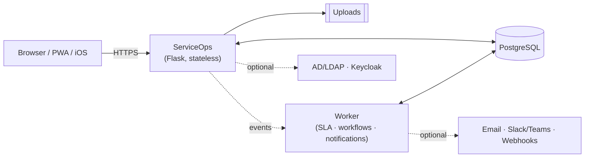

# ServiceOps

Self-hosted ITSM platform — incidents, changes, problems, requests, CMDB,
service catalog, SLAs, and approvals. No vendor lock-in, runs on your own
infrastructure.

[](https://github.com/awijesundara/ServiceOps/actions/workflows/supply-chain.yml)
[](VERSION)
[](Dockerfile)
[](#deploy)
[](#architecture)

<table>
<tr>
<td width="50%"><br><sub>Dashboard</sub></td>
<td width="50%"><br><sub>Incident detail</sub></td>
</tr>
<tr>
<td width="50%"><br><sub>Task board</sub></td>
<td width="50%"><br><sub>Service catalog</sub></td>
</tr>
</table>

## Features

- Incidents, major incidents, changes, problems, and service requests
- Service catalog with approval-routed fulfillment (REQ/RITM/SCTASK)
- CMDB with asset and service-map ownership, NetBox sync
- Manager / CI-owner / CCB approval chains with reapproval on material change
- SLAs, escalations, workflow automation, in-app + email + chat notifications
- Threaded ticket comments, @mentions, and follow/watch
- Analytics dashboard (MTTR, SLA compliance, CSAT, backlog aging) with CSV export
- Public status page for major incidents and service uptime
- Tamper-evident audit log, versioned REST API, installable PWA, native iOS app
- AD/LDAP + Keycloak login, MFA, passkeys

## Quick start

```bash
git clone https://github.com/awijesundara/ServiceOps.git
cd ServiceOps
./serviceops install web
```

Opens a guided installer at <http://127.0.0.1:8090> that checks Docker,
ports, and PostgreSQL, then deploys the app for you. This is a local/eval
setup — for production, use one of the options below.

## Deploy

| Target | Guide |
|---|---|
| Single server (RPM) | [Install guide](https://github.com/awijesundara/serviceops-notes/blob/main/docs/DEPLOYMENT.md#rpm-packaging-linux-distribution) |
| Kubernetes (HA) | [Install guide](https://github.com/awijesundara/serviceops-notes/blob/main/docs/DEPLOYMENT.md#kubernetes-production-deployment) |
| Air-gapped | [Offline bundle](tools/offline/README.md) |

RPM builds are published for EL8/EL9/EL10 and Fedora 43/44 on every
[release](https://github.com/awijesundara/ServiceOps/releases). One-command
setup:

```bash
sudo dnf install -y ./serviceops-*.rpm
sudo serviceops setup --mode bundled --yes
```

Production installs get automated health checks, daily verified backups, and
a `serviceops` CLI (`status`, `health`, `backup`, `update`, `logs`). Full
walkthrough, including HTTPS and firewall setup, is in the
[deployment guide](https://github.com/awijesundara/serviceops-notes/blob/main/docs/DEPLOYMENT.md).

## Architecture

Stateless Flask app + one worker process + PostgreSQL. No mandatory external
dependencies — search, cache, and object storage are optional adapters.



## Docs

- [Deployment & operations guide](https://github.com/awijesundara/serviceops-notes/blob/main/docs/DEPLOYMENT.md) — install, upgrade, backup/restore, scaling
- [REST API reference](docs/API_REFERENCE.md) — also served at `/api/v1/docs`
- [Platform manual (PDF)](docs/ServiceOps_Complete_Platform_Manual.pdf)
- [Engineering notes](https://github.com/awijesundara/serviceops-notes) — architecture decisions, release process

## Development

```bash
python -m venv .venv && source .venv/bin/activate
pip install -r requirements-dev.txt
pytest -q
```

Every push runs the full quality gate (tests, lint, CodeQL, migration safety);
a green run on `main` auto-publishes the next patch release with signed
images, SBOM, and provenance.

## Independence

ServiceOps is an independent implementation, not affiliated with or
compatible-by-design with any commercial ITSM product. No third-party
proprietary code, licensed connectors, or hosted AI services are included —
integrations (AD, SIEM, chat, etc.) connect to systems you choose and control.
